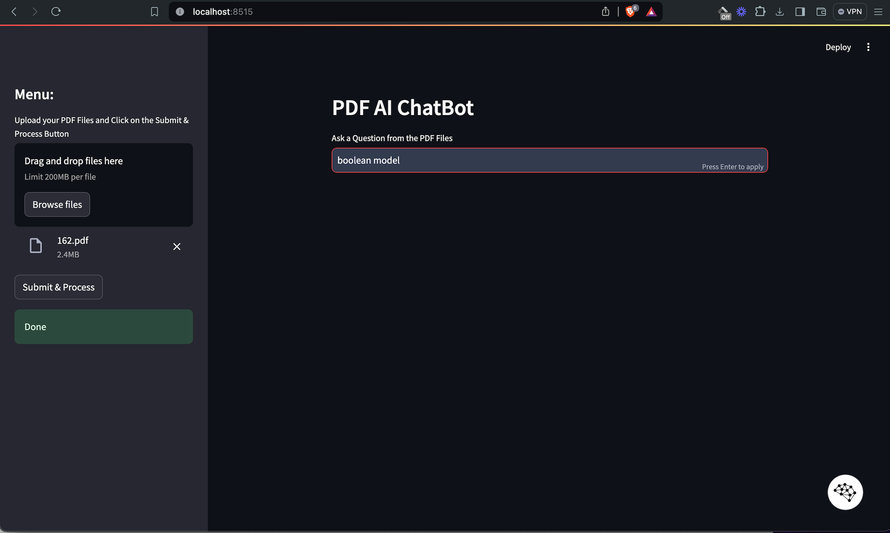

**Setting the Stage with Necessary Tools:**
- **Streamlit:** Creates the web interface.
- **PyPDF2:** Reads PDF files.
- **Langchain:** Tools for natural language processing and creating conversational AI.
- **FAISS:** Efficient similarity search of vectors.

**Reading and Processing PDF Files:**
- **PDF Reader:** Reads uploaded PDF files, extracting and merging text into a single string.
- **Text Splitter:** Uses Langchain to divide the text into 1000-character chunks for efficient processing.

**Creating a Searchable Text Database and Making Embeddings:**
- **Vector Store:** Uses FAISS to convert text chunks into vectors, enabling fast and efficient searches within the text.

**Setting Up the Conversational AI:**
- **AI Configuration:** Sets up a conversational AI using OpenAI's GPT model to answer questions based on processed PDF content.
- **Conversation Chain:** Uses prompts to understand context and provide accurate responses. If an answer isn't available in the text, it responds with "answer is not available in the context."

**User Interaction:**
- **User Interface:** Simple text input for questions related to PDF content, with responses displayed on the web page.
- **File Uploader and Processing:** Allows users to upload new PDF files anytime, updating the database on the fly for AI searching.

